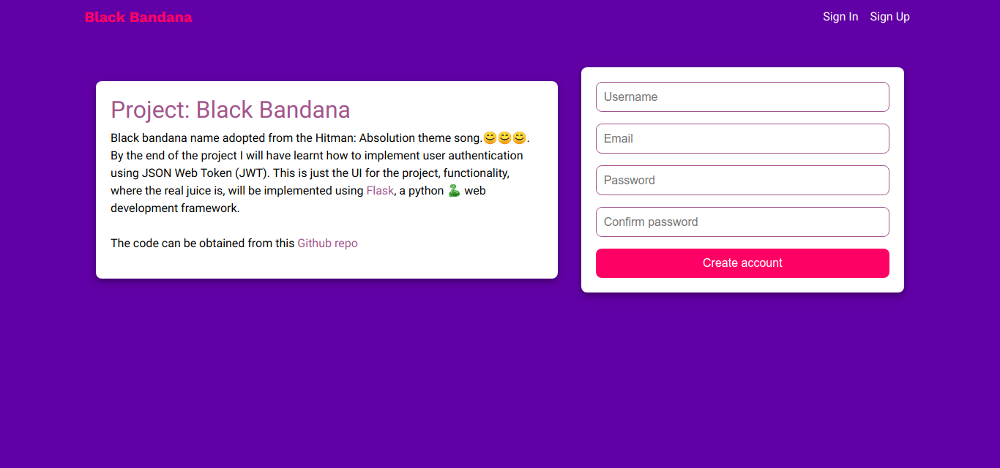

 

 
# black-bandana
user authentication using JSON Web Tokens in Flask Web API

   
  
  <a href="https://chegebryan.github.io/black-bandana/UI">UI</a> Hosted with ❤️ at Github pages

## Getting started
Clone the project to your local at `git clone https://github.com/ChegeBryan/black-bandana.git`

## Acknowledgements
Hat tip to self for the passion to learn. 😎😎😎 
